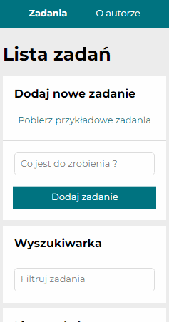
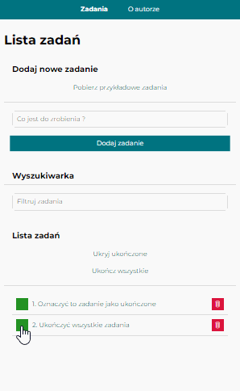

<p align="right">
  🌍 <a href="README-pl.md">polski</a> ∙ <a href="README.md">English</a>
</p>

# Lista rzeczy do zrobienia
[**Wypróbuj teraz**](https://to-do-list-typescript-react.netlify.app/) i odkryj wszystkie możliwości aplikacji!  

</br>

* [Prezentacja](#-prezentacja)
* [Deployment](#-deployment)
* [Technologie](#-technologie)
* [Opis](#-opis)
* [Konfiguracja](#-konfiguracja)
* [Widok aplikacji](#-widok-aplikacji)
* [Instrukcje użytkowania](#-instrukcje-użytkowania)

</br>

## 🎬 Prezentacja


<br>

## 🚀 Deployment
* [**Nowa wersja :**](https://to-do-list-typescript-react.netlify.app/)</br>
Funkcjonalności wymagające komunikacji z bazą danych i obsługą użytkownika zostały wdrożone za pomocą <b>Netlify</b> – platformy oferującej obsługę funkcji <b>serverless</b> i <b>uwierzytelnianie</b>. Dzięki <b>Netlify GoTrue</b> aplikacja umożliwia zarządzanie kontem użytkownika, w tym rejestrację, logowanie, resetowanie i zmianę hasła oraz usuwanie konta. Dodatkowo, aplikacja umożliwia przechowywanie list zadań w bazie danych <b>MongoDB</b>, co pozwala na ich późniejsze pobieranie, edytowanie oraz zapisywanie.
Aplikacja wspiera tłumaczenie całej strony na trzy języki: <b>polski (pl)</b>, <b>angielski (en)</b> i <b>niemiecki (de)</b> dzięki zastosowaniu <b>react-i18next</b>. Zostały również wdrożone nowe funkcje, takie jak dynamiczne tłumaczenie komunikatów błędów za pomocą <b>Cloud Translation API</b>, które zapewniają, że komunikaty serwera będą tłumaczone na bieżąco w zależności od wybranego języka użytkownika.
Nowością jest także przejście na <b>TanStack Query</b> (dawniej <b>React Query</b>) do obsługi zapytań i mutacji w aplikacji, co znacząco upraszcza zarządzanie stanem i operacjami asynchronicznymi. Cała aplikacja została również dostosowana do pracy z <b>TypeScript</b>, co poprawia stabilność kodu i ułatwia jego utrzymanie.<br/>https://to-do-list-typescript-react.netlify.app

* [**Stara wersja :**](https://mariuszmmm.github.io/to-do-list-react)</br>
Aktualnie starsza wersja aplikacji znajduje się na branchu <b>gh-pages</b> i jest dostępna pod adresem:</br>https://mariuszmmm.github.io/to-do-list-react

</br>

## 🛠 Technologie

<ul>
<li>TypeScript, JavaScript (ES6+)</li>
<li>React & JSX, React Router</li>
<li>Redux, Redux Toolkit, Redux Saga</li>
<li>TanStack Query (react-query)</li>
<li>react-i18next, Cloud Translation API</li>
<li>Netlify GoTrue.js</li>
<li>MongoDB</li>
<li>Normalize.css, Styled Components</li>
<li>CSS Grid & Flexbox, Media Queries</li>
<li>Controlled Components</li>
</ul>

<br>

## 📝 Opis
<b>Lista rzeczy do zrobienia</b> to aplikacja stworzona w oparciu o bibliotekę React z wykorzystaniem TypeScript. Wersja aplikacji została znacząco rozbudowana – oprócz klasycznych funkcji to-do list, wprowadzono szereg nowych usprawnień i możliwości:
* <b>Podstawowe funkcjonalności:</b>
   * Pobieranie przykładowych zadań <i>(gdy lista jest pusta)</i>,
   * Dodawanie nowych zadań,
   * Oznaczanie zadań jako ukończone,
   * Wyszukiwanie zadań z możliwością pokazania/ukrycia filtra oraz jego wyczyszczenia,
   * Wyświetlanie szczegółów zadania,
   * Usuwanie zadań,
   * Ukrywanie ukończonych zadań,
   * Oznaczanie wszystkich zadań jako ukończone oraz funkcja "Odznacz wszystkie".
   * Sortowanie zadań.
* <b>Nowe funkcjonalności:</b>
   * <b>Obsługa TypeScript:</b> Aplikacja została przepisana na TypeScript dla lepszej kontroli typów i utrzymania kodu.
   * <b>TanStack Query:</b> Zastąpienie ręcznego fetching’u (Redux Saga) hookami useQuery do pobierania przykładowych zadań i list oraz useMutation do obsługi mutacji list i operacji związanych z użytkownikiem.
   * <b>react-i18next:</b> Tłumaczenie całej aplikacji na języki pl, en, de.
   * <b>Dynamiczne tłumaczenie błędów:</b> Komunikaty błędów zwracane z serwera są tłumaczone w locie przy pomocy Cloud Translation API.
   * <b>Uproszczone zarządzanie stanem:</b> Redux i Saga pozostawione wyłącznie do stanów globalnych aplikacji; logika pobierania i mutacji przeniesiona do TanStack Query.
   * <b>Zarządzanie kontem użytkownika:</b>
   <i>(Implementacja oparta o bibliotekę [Netlify GoTrue](https://github.com/netlify/gotrue-js) z własnymi komponentami UI.)</i>
      * Rejestracja,
      * Logowanie,
      * Resetowanie i zmiana hasła,
      * Usuwanie konta.<br>
      
* <b>Strona List:</b></br>
Po zalogowaniu użytkownik ma dostęp do strony "Listy", gdzie wyświetlane są wszystkie zapisane listy pobierane z bazy danych MongoDB. Na tej stronie możliwe jest:
   * Podgląd zawartości wybranej listy,
   * Załadowanie zawartości listy do bieżącej listy zadań,
   * Sortowanie listy,
   * Usunięcie listy.
* <b>Zapisywanie listy do bazy danych:</b></br>
Po zalogowaniu użytkownik ma możliwość zapisania aktualnej listy zadań do bazy.
* <b>Edycja zadania:</b></br>
Umożliwiono edycję treści zadania (poprzez ikonę ołówka) oraz wprowadzono funkcje cofania/ponawiania zmian.

Aplikacja zapewnia przyjazny i intuicyjny interfejs, który wspiera zarządzanie zadaniami.

</br>

## ⚙ Konfiguracja
Aby uruchomić aplikację to-do-list-react lokalnie, wykonaj poniższe kroki:

1. <b>Pobranie kodu źródłowego:</b><br>
Sklonuj repozytorium z GitHub:
```commandline
     git clone https://github.com/mariuszmmm/to-do-list-react.git
```
2. <b>Instalacja zależności:</b><br>
Przejdź do katalogu projektu i zainstaluj wszystkie zależności:
```commandline
    cd to-do-list-react
    npm install
```
3. <b>Konfiguracja środowiska:</b><br>
Utwórz plik .env w katalogu głównym projektu i zdefiniuj zmienne środowiskowe:
```commandline
   MONGODB_URI=twoja_mongodb_uri
   MONGODB_DATABASE=twoja_baza_danych
   WEBHOOK_SECRET=twoj_webhook_secret
   REACT_APP_CONFIRMATION_URL="http://localhost:8888/#/user-confirmation"
   REACT_APP_RECOVERY_URL="http://localhost:8888/#/account-recovery"
   TRANSLATION_API_KEY="twoj_translation_api_key"
   TRANSLATION_API_URL="https://translation.googleapis.com/language/translate/v2"
```
4. <b>Uruchomienie aplikacji:</b><br>
Po zainstalowaniu zależności uruchom aplikację w trybie deweloperskim:
```commandline
    npm start
```
Aplikacja uruchomi się pod adresem http://localhost:8888.

<br>

## 🖥 Widok aplikacji
Aplikacja jest w pełni responsywna, co oznacza, że dostosowuje się do różnych urządzeń (smartfony, tablety, komputery).
Przykładowe widoki:

- <b>320x568</b> <i>(Podstawowy widok na telefonie)</i>  


- <b>600x960</b> <i>(Widok na tablecie)</i>  


</br>

## 📄 Instrukcje użytkowania
<b>Pobieranie przykładowych zadań</b>
* Wybierz opcję <b>"Pobierz przykładowe zadania"</b> – zadania zostaną pobrane tylko wtedy, gdy bieżąca lista zadań jest pusta.

</br>

<b>Dodawanie zadania</b>
* Wprowadź nazwę zadania w polu tekstowym i kliknij <b>"Dodaj zadanie"</b> lub naciśnij klawisz <b>Enter</b>.

</br>

<b>Oznaczanie zadania jako ukończone</b>
* Kliknij pole wyboru obok zadania, aby je oznaczyć jako ukończone.

</br>

<b>Edycja zadania</b>
* Kliknij ikonę ołówka, aby edytować treść zadania.
* Skorzystaj z funkcji cofania/ponawiania zmian, jeśli potrzebujesz cofnąć lub przywrócić edycję.

</br>

<b>Wyszukiwanie zadań</b>
* Wpisz słowo lub frazę w pole wyszukiwania.
* Użyj funkcji <b>Pokaż/Ukryj</b> filtr lub <b>Wyczyść filtr</b> dla lepszej kontroli wyników.

</br>

<b>Zarządzanie zadaniami</b>
* <b>Wyświetlanie szczegółów:</b> Kliknij zadanie, aby wyświetlić jego szczegółowe informacje.
* <b>Usuwanie zadania:</b> Kliknij ikonę kosza przy zadaniu, aby je usunąć.
* <b>Ukończ wszystkie / Odznacz wszystkie:</b> Pozwala na oznaczenie wszystkich zadań jako ukończone lub ich odznaczenie.
* <b>Włącz/Wyłącz sortowanie:</b> Przełącza tryb sortowania. W widoku listy pojawią się przyciski umożliwiające przesuwanie zadań w górę i w dół.

</br>

<b>Cofanie i ponawianie zmian</b>
* Kliknij przycisk <b>"↺"</b> – ostatnia operacja na liście zadań zostanie wycofana.
* Kliknij przycisk <b>"↻"</b> – cofnięta operacja zostanie przywrócona.
</br>
Przyciski są aktywne tylko wtedy, gdy możliwe jest cofnięcie lub ponowienie ostatniej operacji.
  
</br>

<b>Zapisywanie listy zadań</b> (dostępne dla zalogowanych użytkowników)
* Wybierz opcję <b>"Zapisz listę"</b> – lista zadań zostanie zapisana w bazie danych. Jeśli nazwa zapisywanej listy już istnieje, możesz ją zmienić lub nadpisać istniejącą.

</br>

<b>Zarządzanie kontem użytkownika</b>
* Po zalogowaniu użytkownik uzyskuje dostęp do:
   * <b>Zmiany hasła, usuwania konta oraz innych funkcji konta.</b>
   * <b>Strony "Listy":</b> Przegląd zapisanych list, podgląd zawartości, ładowanie listy do bieżącej listy zadań lub jej usunięcie.
   * <b>Możliwości zapisywania bieżącej listy do bazy danych.</b>