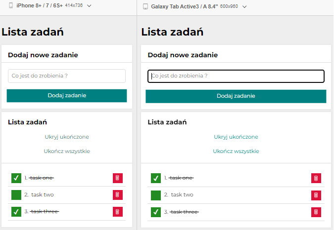

<p align="right">
  🌍 <a href="README-pl.md">polski</a> ∙ <a href="README.md">English</a>
</p>

# [To-do list](https://mariuszmmm.github.io/to-do-list-react/)
* [Try it Now](https://mariuszmmm.github.io/to-do-list-react/)
* [Presentation](#-presentation)
* [Description](#-description)
* [Technologies](#-technologies)
* [Setup](#-setup)
* [Application view](#-application-view)
<br>

## 🎬 Presentation


<br>

## 📝 Description
<b>'To-do List'</b> is an application built using the React.js library.<br>

The application enables:
- aAdding new tasks to the list,
- marking tasks as completed,
- removing tasks from the list,
- hiding completed tasks,
- marking all tasks as completed.

Utilize this application to efficiently manage your tasks and track progress in completing your duties!

User Instructions:

1. Adding a task:
   - Enter the task name in the text field.
   - Press the "Add Task" button or hit the Enter key to add the task to the list.
2. Marking a task as completed:
   - Click on the checkbox next to the task to mark it as completed.
4. Removing a task:
   - Click the delete button (trash can icon) next to the task to remove it from the list.
5. Hiding completed tasks:
   - Use the "Hide completed" or "Show completed" option to hide or reveal completed tasks on the list.
6. Marking all tasks as completed:
   - Utilize the "Complete all" option to mark all tasks as completed.

<br>

## 🛠 Technologies

<ul>
<li>JavaScript ES6+ Features</li>
<li>React.js</li>
<li>JSX</li>
<li>CSS Grid</li>
<li>CSS Flex</li>
<li>Normalize.css</li>
<li>Styled Components</li>
<li>Media Queries</li>
<li>Controlled Components</li>
<li>Redux</li>
</ul>

<br>

## ⚙ Setup
To run the program from the 'to-do-list-react' repository on your local computer, you can follow these steps:
1. <b>Downloading the source code:</b><br>
Clone the repository from the GitHub page to your local computer using the command:
```commandline
     git clone https://github.com/mariuszmmm/to-do-list-react.git
```
2. <b>Dependency Installation:</b><br>
Navigate to the project directory, then install all required dependencies using a package manager like npm:
```commandline
    cd to-do-list-react
    npm install
```
3. <b>Launching the Application:</b><br>
After installing the dependencies, you can run the application locally. Use the command:
```commandline
    npm start
```
  This command will start the application in developer mode, opening it in a browser at http://localhost:3000.

<br>

## 🖥 Application view
The application is fully responsive and adapts to various devices.<br>
Screenshots showcase the app's appearance on both phones and tablets, demonstrating how it responsively adjusts to screen size changes


