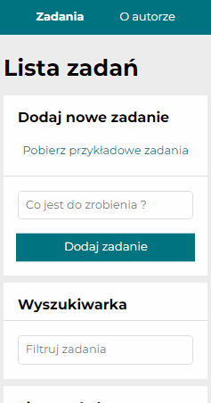

<p align="right">
  🌍 <a href="README-pl.md">polski</a> ∙ <a href="README.md">English</a>
</p>

# To-Do List Application
[**Try it now**](https://to-do-list-typescript-react.netlify.app/) and discover all the possibilities of the application!  
<span style="color: grey;">Note: The older version is deployed on the gh-pages branch, while the new version with additional functionalities is deployed on Netlify.</span>

</br>

* [Presentation](#-presentation)
* [Description](#-description)
* [Technologies](#-technologies)
* [Setup](#-setup)
* [Application views](#-application-views)
* [Deployment](#-deployment)
* [User Instructions](#-user-instructions)

</br>

## 🎬 Presentation


<br>

## 📝 Description
<b>To-Do List</b> is a React-based application now enhanced with TypeScript for improved type safety and maintainability. In addition to the classic to-do list features, this version includes several new functionalities:
* <b>Core Features:</b>
   * Fetch sample tasks <i>(when the list is empty)</i>,
   * Add new tasks,
   * Mark tasks as completed,
   * Search tasks with options to show/hide and clear filters,
   * View task details,
   * Delete tasks,
   * Hide completed tasks,
   * Mark all tasks as completed and now also unmark all tasks.
* <b>New Functionalities:</b>
   * <b>TypeScript Integration: </b> The application now uses TypeScript for better type checking and easier maintenance.
   * <b>User Account Management:</b>
      * Registration,
      * Login,
      * Password reset and change,
      * Account deletion.<br>
      
      <i>(While Netlify Identity offers a built-in login widget, custom components built on [netlify gotrue.js](https://github.com/netlify/gotrue-js) are used.)</i>
* <b>Lists Page:</b></br>
After logging in, users can access a "Lists" page that displays all saved lists retrieved from a MongoDB database. From this page, you can:
   * View the contents of a selected list,
   * Load the selected list into your current tasks,
   * Delete the list.
* <b>Saving Tasks:</b></br>
Once logged in, you can also save the current to-do list to the database.
* <b>Task Editing:</b></br>
Tasks can be edited (using the pencil icon) with options to undo and redo changes.

The application offers a user-friendly interface that supports effective task management.

</br>

## 🛠 Technologies

<ul>
<li>TypeScript</li>
<li>JavaScript ES6+ Features</li>
<li>React & JSX</li>
<li>CSS Grid & CSS Flex</li>
<li>Normalize.css</li>
<li>Styled Components</li>
<li>Media Queries</li>
<li>Controlled Components</li>
<li>Redux, Redux Toolkit, Redux Saga, Redux Router</li>
</ul>

<br>

## ⚙ Setup
To run the to-do-list-react application locally, follow these steps:

1. <b>Clone the Repository:</b><br>
Clone the GitHub repository to your local machine:
```commandline
     git clone https://github.com/mariuszmmm/to-do-list-react.git
```
2. <b>Install Dependencies:</b><br>
Navigate to the project directory and install all required dependencies:
```commandline
    cd to-do-list-react
    npm install
```
3. <b>Configure Environment Variables:</b><br>
Create a .env file in the root directory and define the following variables:
```commandline
   MONGODB_URI=your_mongodb_uri
   MONGODB_DATABASE=your_database
   WEBHOOK_SECRET=your_webhook_secret
   REACT_APP_CONFIRMATION_URL="http://localhost:8888/#/user-confirmation"
   REACT_APP_RECOVERY_URL="http://localhost:8888/#/account-recovery"
```
4. <b>Start the Application:</b><br>
Run the application in development mode:
```commandline
    npm start
```
The app will launch in your browser at http://localhost:8888.

<br>

## 🖥 Application Views
The application is fully responsive and adapts to various devices, including smartphones, tablets, and desktops.
Example views:

- <b>320x568</b> <i>(Mobile view)</i>  


- <b>600x960</b> <i>(Tablet view)</i>  


</br>

## 🚀 Deployment
* <b>Older Version:</b></br>
The older version is hosted on the <b>gh-pages</b> branch and can be accessed at:</br>
https://mariuszmmm.github.io/to-do-list-react

* <b>New Version:</b></br>
Features that require database communication and advanced user authentication have been deployed on <b>Netlify</b>.  This platform offers serverless functions and robust user authentication.

</br>

## 📄 User Instructions
<b>Fetching Sample Tasks</b>
* Click the <b>"Pobierz przykładowe zadania"</b> option – tasks will be loaded only if your current task list is empty.

</br>

<b>Adding a Task</b>
* Enter a task name in the text field and click <b>"Dodaj zadanie"</b> or press <b>Enter</b>.

</br>

<b>Marking a Task as Completed</b>
* Click the checkbox next to a task to mark it as completed.

</br>

<b>Editing a Task</b>
* Click the pencil icon to edit a task's content.
* Use the undo/redo options to revert or restore changes.

</br>

<b>Searching for Tasks</b>
* Enter a keyword or phrase in the search field.
* Use the <b>pokaż/ukryj filtr</b> or <b>wyczyść filtr</b> functions for better control of the results.

</br>

<b>Task Management</b>
* <b>View Details:</b> Click on a task to see its details.
* <b>Delete Task:</b> Click the trash icon next to a task to remove it.
* <b>Mark/Unmark All:</b> Use the options to mark all tasks as completed or unmark all.

</br>

<b>User Account Management</b>
* After logging in, users can access:
   * <b>Account Functions:</b> Registration, login, password reset/change, and account deletion.
   * <b>Lists Page:</b> View saved lists, inspect list contents, load a list into the current tasks, or delete a list.
   * <b>Saving Tasks:</b>Save the current to-do list to the database.
